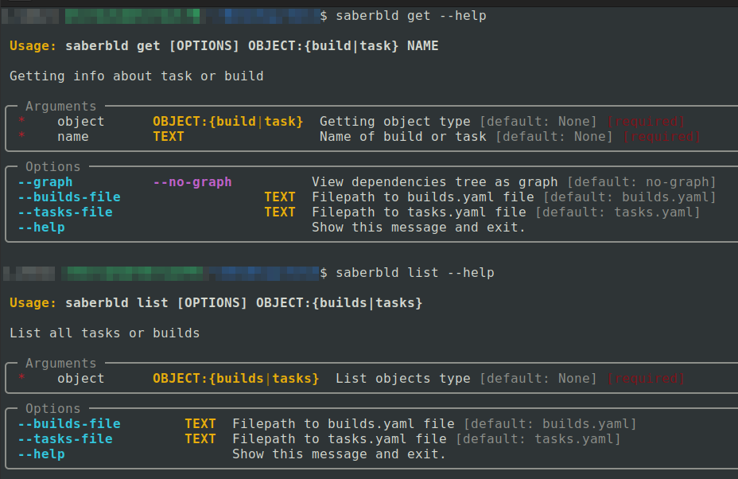

# saberbld

## About

CLI application for comfort view information about builds ant tasks

## Prerequisites

* Python >= 3.10
* PDM >= 2.5.3 (optional)

## How it works

This utility parses two files with `builds` and `tasks` and outputs them according to a certain requirement: when you output an assembly or task, you need to have dependencies first, and then tasks. In addition, the program can draw a dependency graph

The application is based on the Typer framework, which provides a convenient toolkit for creating an application CLI interface and input verification

## Installation

```bash
pip install git+https://github.com/AndrewLaptev/saberbld
```

or with optional dependencies for testing:

```bash
pip install "saberbld[tests] @ git+https://github.com/AndrewLaptev/saberbld"
```

Also you can install via `pdm`:

```bash
pdm add git+https://github.com/AndrewLaptev/saberbld
```

or with optional dependencies for testing:

```bash
pdm add "saberbld[tests] @ git+https://github.com/AndrewLaptev/saberbld"
```

## Usage

After installation, this utility is run by the command:
```
saberbld
```

Utility have a next commands:

 - `get` - getting info about task or build
 - `list` - list all tasks or builds

 and options:

  - `--builds-file` - filepath to builds.yaml file
  - `--tasks-file` - filepath to tasks.yaml file
  - `--graph` - view dependencies tree as graph

The Typer framework allows you to implement adaptive help information depending on the team. Information about data types and default values is also displayed in a convenient format:




## Testing

Testing of this program is carried out using the `pytest` library, and the measurement of code coverage is carried out using `pytest-cov`

Results of last test coverage keep in `tests/coverage.txt`

To run the tests, after installing the package with additional dependencies from the tests group, enter the command:

```
pytest -v
```

To run tests with coverage measurement, run this command:

```
pytest -v --cov
```